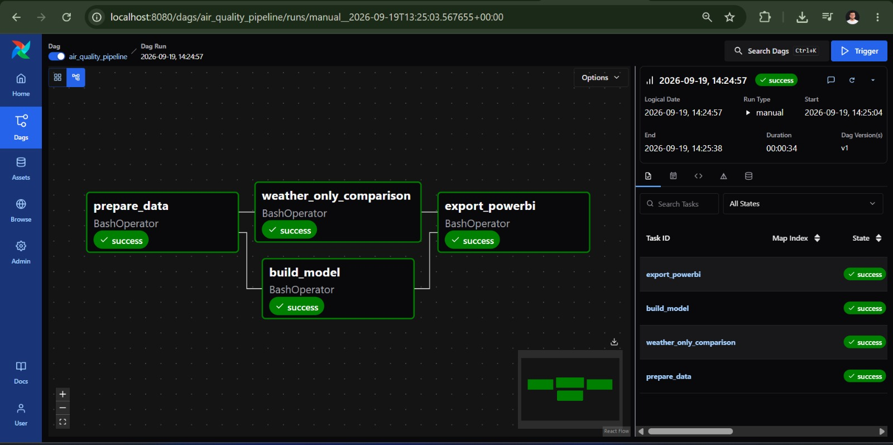
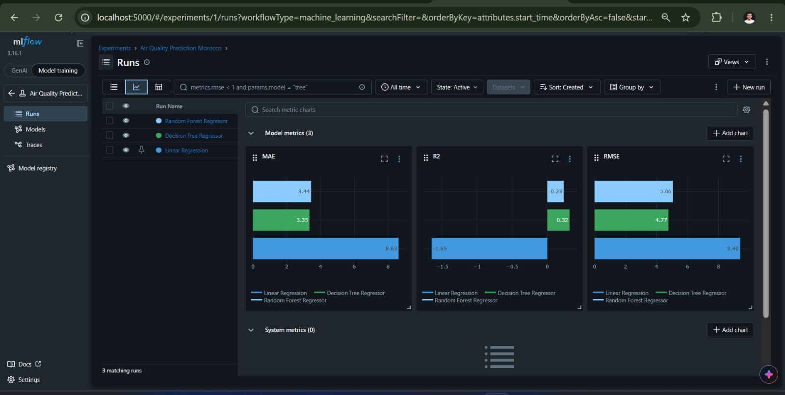
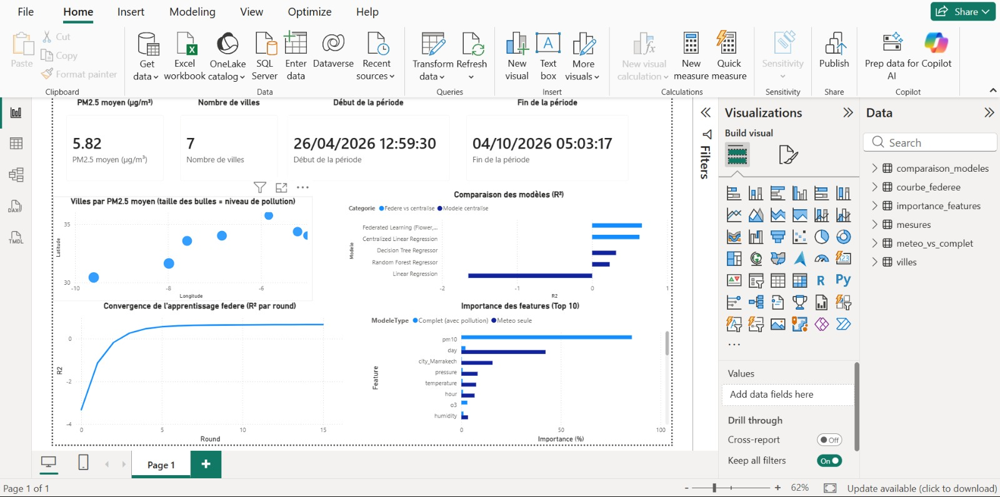

# Air Quality Prediction in Moroccan Cities


A data science project for predicting **PM2.5 concentrations in Moroccan cities** using weather and air-pollution data collected with the OpenWeatherMap API.

The project combines a classical machine-learning pipeline with **Airflow**, **MLflow**, **Docker**, **Power BI**, and an experimental **federated learning** setup with Flower.

## What the project does

The pipeline:

1. merges and prepares the collected data;
2. creates a chronological train/test split;
3. trains several regression models;
4. tracks experiments and models with MLflow;
5. compares full-feature and weather-only models;
6. exports the results for Power BI.

The Airflow DAG runs the preparation step first, then trains the models and runs the weather-only comparison in parallel, before exporting the final Power BI files.

## Screenshots

### Airflow pipeline



### MLflow experiment tracking



### Power BI dashboard



## Latest model results

The current centralized models use a **chronological 80/20 split**, which is more realistic for time-dependent pollution data than a random split.

| Model | MAE | RMSE | R² |
|---|---:|---:|---:|
| Linear Regression | 8.626 | 9.398 | -1.649 |
| **Decision Tree Regressor** | **3.346** | **4.768** | **0.318** |
| Random Forest Regressor | 3.442 | 5.056 | 0.233 |

On the latest collected data, the **Decision Tree Regressor** gives the best result among the three centralized models.

The results are tracked automatically in MLflow under the experiment:

```text
Air Quality Prediction Morocco
```

MLflow stores the metrics, parameters, and trained scikit-learn models for each run.

## Federated learning experiment

A second experiment explores federated learning with **Flower + FedAvg**, using the cities as separate clients.

| Approach | MAE | RMSE | R² |
|---|---:|---:|---:|
| Centralized Linear Regression | 0.932 | 1.134 | 0.630 |
| Federated Learning (Flower, FedAvg) | **0.791** | **1.082** | **0.663** |

These numbers should not be interpreted as proof that federation is better than centralization, because the centralized and federated experiments currently use different learning algorithms. They are mainly used to demonstrate the federated-learning workflow.

## Feature importance

PM10 is by far the most important feature in the tree-based models.

This is an important result of the project: much of the predictive performance comes from the strong relationship between **PM2.5 and PM10**, while weather-only models perform much worse.

## Project structure

```text
.
├── airflow/
│   ├── dags/
│   │   └── air_quality_pipeline.py
│   └── Dockerfile
├── data/
│   ├── raw/
│   └── powerbi/
├── docs/
│   ├── airflow.jpeg
│   ├── mlflow_air_quality_model_metrics.jpeg
│   └── air-quality-morocco-dashboard.jpeg
├── notebooks/
│   └── 01_exploratory_data_analysis.ipynb
├── results/
├── scripts/
│   ├── 01_collect_data.py
│   ├── 02_prepare_data.py
│   ├── 03_build_model.py
│   ├── 04_federated_learning.py
│   ├── 05_weather_only_comparison.py
│   └── 06_export_powerbi.py
├── docker-compose.yml
├── requirements.txt
├── requirements-airflow.txt
└── README.md
```

## Run with Docker and Airflow

Build and start the project:

```bash
docker compose up -d --build
```

Open Airflow:

```text
http://localhost:8080
```

Then trigger:

```text
air_quality_pipeline
```

Open MLflow:

```text
http://localhost:5000
```

The MLflow server is connected to the Airflow training task, so each execution of `03_build_model.py` creates new tracked runs automatically.

## Updating the data

New raw data can be added to:

```text
data/raw/
```

After pulling new data from GitHub, simply rerun the Airflow DAG. The preparation, model training, MLflow tracking, and Power BI export will be regenerated from the updated dataset.

## Power BI

The dashboard uses CSV files generated automatically in:

```text
data/powerbi/
```

It includes:

- average PM2.5 by city;
- model comparison;
- federated-learning convergence;
- feature importance;
- full-feature vs. weather-only comparison.

## Tech stack

**Python 3.11 · pandas · scikit-learn · MLflow · Apache Airflow · Docker · Flower · Power BI · GitHub Actions**

## Main takeaway

This project started as a PM2.5 prediction task, but the experiments also revealed an important limitation: pollution-related variables, especially PM10, carry much more predictive information than weather variables alone.

That result is kept visible rather than hidden, because understanding why a model works is as important as obtaining a good score.
